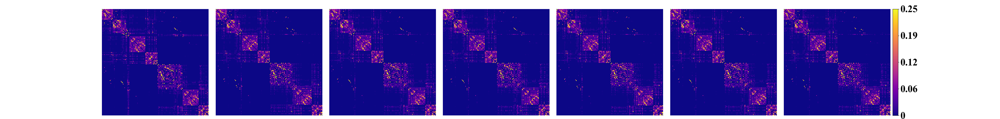

# Group-wise Graph Learning
We  present  here  a  novel  group-wise graph learning method with the application in brain structural network.
we assume that the observed brain network data consists of intrinsic connectivity information as well as external noise.
To alleviate the issue of spurious connections at each brain network node, we introduce a sparsity constraint. 
To achieve the longitudinal consistency, we jointly consider the longitudinal sequence of networks in two ways.
First, we examine the connectivity trajectory at each link of the network, where we deploy the kernel smoothing technique to prevent outlier connectivity due to 
the possible noise or computational error in the image processing pipeline.
Second, we require high-level network geometry quantified by metrics such as network modularity to remain stable along time.

## Result

## Dependecies
We tested our method with the following environment
* python 3.6
* numpy 1.16.4
* matplotlib 3.1.0
* bctpy
* sklearn

## Running the method
Run `test.py` to run the method. This method takes input from `data/sub_1` directory and writes the 
intrinsic connectomes in `data/sub_1_intrinsic` directory. We have provided only one sample subject.

`show_result.py` generates the matrix plot for the raw and the intrinsic connectomes
and saves them in `raw.png` and `intrinsic.png` respectively.

## Evaluation
`Evaluation/evaluation_psnr.py` contains the code for the first experiment.
* `eval_psnr` plots the PSNR plot in Fig. 2(b).
* `spurious_change_ratio` prints the spurios change ration mentioned in the paper

`variation_of_information.py` computes the NVI mentioned in the second experiment
in our paper.

`classification/svm.py` contains the code for the classification experiment which
is the third experiment in our paper.

## Author
Md Asadullah Turja.  
email: mturja@cs.unc.edu
